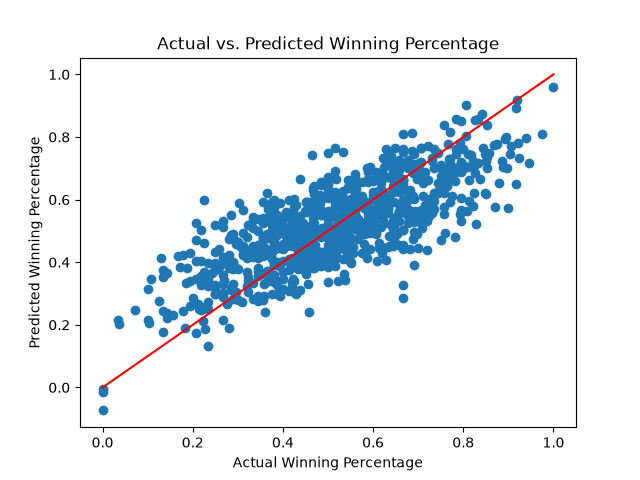

# College Basketball Data Analysis

## Overview

This project performs a beginner-level analysis of Division I college basketball data using Python, Pandas, Matplotlib, and scikit-learn. The dataset contains team-level statistics from the 2013–2019 and 2021–2025 seasons. The 2020 season is not included because the NCAA Tournament was canceled that year due to COVID-19.

The analysis includes importing and inspecting the data, checking for missing values and duplicates, filtering meaningful subsets, calculating summary statistics with `groupby()`, creating a visualization, and exploring a linear regression model.

## Dataset

The dataset is from Kaggle and was scraped from Bart Torvik's college basketball rankings and include team performance, conference, efficiency, shooting, rebounding, turnover, free-throw, postseason, seed, and season information.

The dataset can be downloaded here: https://www.kaggle.com/datasets/andrewsundberg/college-basketball-dataset?resource=download

Important variables include:

- `W` and `G`: wins and games played
- `ADJOE`: adjusted offensive efficiency
- `ADJDE`: adjusted defensive efficiency
- `EFG_O` and `EFG_D`: offensive and defensive effective field-goal percentage
- `TOR` and `TORD`: turnovers committed and turnovers generated
- `ORB` and `DRB`: offensive rebounding and defensive rebounding rates
- `FTR` and `FTRD`: offensive and defensive free-throw rates
- `3P_O`: offensive three-point shooting percentage
- `ADJ_T`: adjusted tempo
- `POSTSEASON` and `SEED`: tournament outcome and seed

## Analysis

### Data inspection

The script uses `head()` to display the first 50 rows, `info()` to inspect the columns and data types, and `describe()` to view numerical summary statistics. It also uses `isnull().sum()` to count missing values in each column and across the entire dataset, and `duplicated().sum()` to check for exact duplicate rows.

Missing values are expected in `POSTSEASON` and `SEED` because most teams do not reach the NCAA Tournament. These missing values are not automatically errors; they indicate that a team did not receive a postseason result or tournament seed.

### Filters

Two meaningful subsets are created:

1. `twenty_win_teams` contains teams with at least 20 wins. This identifies teams that had a relatively successful regular season.
2. `tournament_teams` contains teams with a nonmissing `POSTSEASON` value. This identifies teams that made the NCAA Tournament.

The complete dataset is retained for the regression analysis so that the model includes successful, average, and weaker teams rather than only a selected group.

### Summary statistics and grouping

The script calculates the overall mean, median, and range of offensive three-point percentage (`3P_O`). 

Additionally, the script groups the data by `YEAR` and calculates yearly means for statistics connected to Dean Oliver's Four Factors (Dean Oliver is considered the father of basketball analytics and his 'Four Factors' are the four statistics he identified as the most impactful to winning basketball games in his 2004 book 'Basketball on Paper'):

- effective field-goal percentage - offensive and defensive;
- turnover rate and turnovers generated rate;
- offensive and defensive rebounding;
- free-throw rate - offensive and defensive.

The offensive and defensive statistics are examined separately because the two sides of the game measure different aspects of performance. For example, lower `TOR` is generally better because it represents turnovers committed, while higher `TORD` is generally better because it represents turnovers generated from opponents.

## Machine Learning: Linear Regression

The script explores multiple linear regression. The model uses the offensive Four Factors as inputs:

```text
EFG_O, TOR, ORB, FTR
```

The outcome is winning percentage, calculated as:

```text
WIN_PCT = W / G
```

Using winning percentage instead of raw wins makes comparisons fairer when teams play different numbers of games.

The data is divided into training and testing sets. Eighty percent of the rows are used to train the model, and 20% are reserved to test its predictions. `random_state=706` makes the random split reproducible, meaning the same rows are selected each time the script runs.

The model is evaluated with mean absolute error, mean squared error, and R-squared. The coefficients are also printed so that the estimated relationship for each Four Factor can be examined.

For the current run, the model produced:

- Mean absolute error: approximately `0.093`, meaning predictions were off by about 9.3 percentage points on average.
- Mean squared error: approximately `0.0134`. Lower values indicate smaller prediction errors.
- R-squared: approximately `0.589`, meaning the Four Factors explained about 58.9% of the variation in winning percentage in the test data.

These results indicate a meaningful relationship between the offensive Four Factors and winning percentage; In further models, the defensive sides of the Four Factors can be evaulated as well to help further explain winning percentage. These Four Factors, however, do not prove that any individual factor causes teams to win. The model does not include every influence on winning, such as defensive performance, strength of schedule, injuries, or coaching.

## Visualization



The script creates a scatterplot comparing the model's predicted winning percentages with the teams' actual winning percentages in the testing dataset.

The actual winning percentage (`y_test`) appears on the x-axis, and the predicted winning percentage (`y_prediction`) appears on the y-axis. Each point represents one team in the testing data.

The red diagonal line represents perfect predictions. Points on the red line would have predicted winning percentages exactly equal to their actual winning percentages. Points farther from the line represent larger prediction errors.

This visualization helps evaluate how closely the linear regression model's predictions match the actual outcomes. The overall pattern of the points shows that the model captures a meaningful relationship between the offensive Four Factors and winning percentage, although the predictions are not perfect.

## How to Run

From the project folder, run:

```bash
python First_Data_Analysis.py
```

The script expects the dataset at:

```text
archive/cbb.csv
```

Required Python packages include:

```text
pandas
numpy
matplotlib
scikit-learn
```

## Files

- `First_Data_Analysis.py`: Python data analysis script
- `archive/cbb.csv`: college basketball dataset
- `README.md`: project documentation


## Rust Jupyter Notebook

The repository also includes the modified `rust_vs_python_intro.ipynb` notebook. The notebook introduces Rust programming and compares some Rust concepts with Python.

The ownership experiments demonstrate:

- immutable and mutable variables using `let` and `let mut`;
- ownership transfer when assigning a `String` or vector to another variable;
- cloning a value with `.clone()` so both variables can own separate copies;
- borrowing values with `&` instead of transferring ownership;
- Rust's compiler errors when a value is used after ownership has moved or when it is modified while borrowed.

The notebook was run using the Rust Jupyter kernel. Some cells are intentionally designed to produce ownership errors so that Rust's ownership and borrowing rules can be observed.

## Polars Analysis

In addition to Pandas, this project uses Polars to repeat a data-grouping operation. Polars is another DataFrame library designed to process data efficiently, especially when working with larger datasets.

The same college basketball CSV file was loaded with Polars. Polars was used to group teams by `YEAR` and calculate the mean offensive effective field-goal percentage (`EFG_O`) for each season. This is equivalent to the Pandas grouping operation used earlier in the script. The Polars results were then sorted by `YEAR` so that the seasons appeared chronologically.

## Pandas and Polars Runtime Comparison

The runtime comparison measured how long Pandas and Polars took to group the data by `YEAR` and calculate the mean of `EFG_O`. Timing began immediately before each grouping operation and ended immediately afterward, so it measured the operations themselves rather than package installation or dataset loading.

In one measured run, the results were:

| Library | Runtime |
|---|---:|
| Pandas | 0.000926 seconds |
| Polars | 0.001295 seconds |

Pandas was slightly faster in this run. However, the difference was only about 0.000369 seconds, or less than half a millisecond. Because this dataset contains only about 4,249 rows and the operation is simple, both libraries completed the task almost immediately.

This result does not mean that Pandas is always faster. Polars is designed to provide larger performance benefits with larger datasets or more complicated operations. For this particular small dataset and operation, the runtime difference was too small to have practical significance.