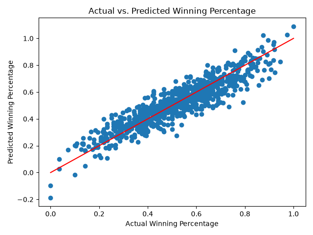
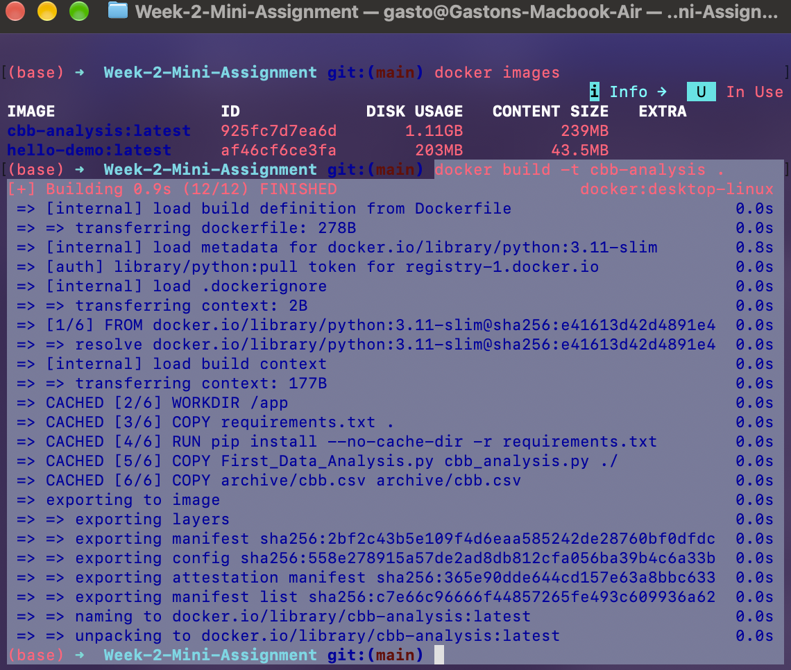
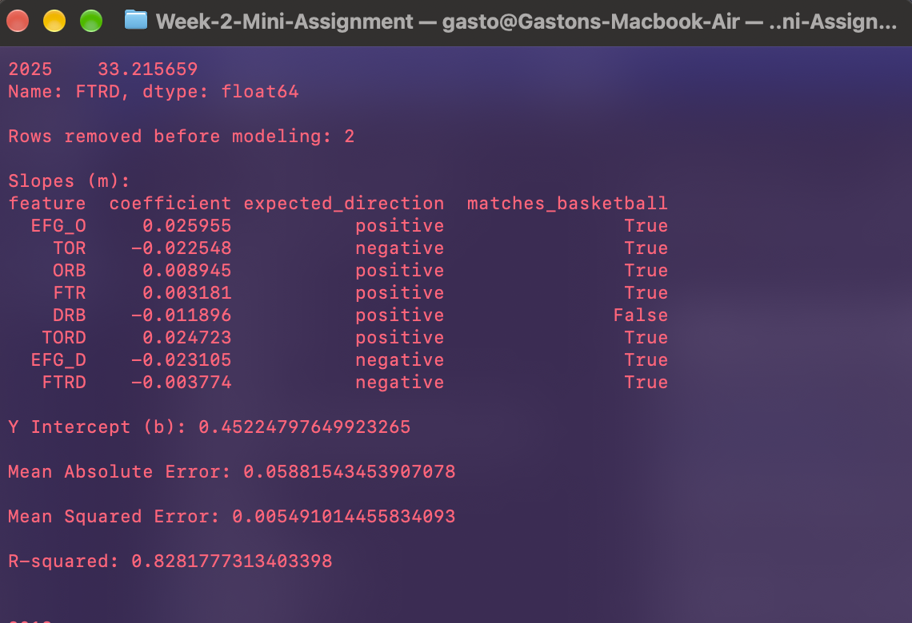
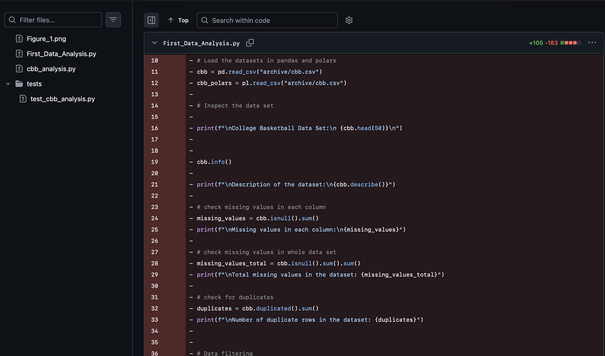
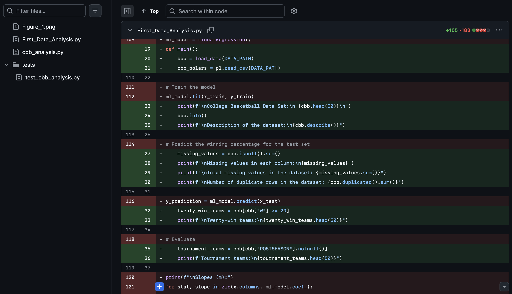

# College Basketball Data Analysis

## Refactoring Slogan
Shed the old skin. Keep the same bite. Refactor your Python.

## Overview of Project

This project is a simple analysis of Division I college basketball data using Python, Pandas, Matplotlib, and scikit-learn. The dataset has team stats from the 2013–2019 and 2021–2025 seasons. The 2020 season is missing because the NCAA Tournament was canceled that year due to COVID-19.

The script loads and inspects the data, checks for missing values and duplicates, filters a couple of subsets, calculates summary statistics with `groupby()`, makes a plot, and fits a linear regression model.

## Research Question

The machine learning part of the project tries to answer this question:

"How well do Dean Oliver's Four Factors of Basketball explain winning percentage in college basketball?"

Dean Oliver's four factors are effective field-goal percentage, turnover rate, rebounding, and free-throw rate. Each one is tracked on offense and on defense, so there are eight inputs in total.

## Dataset

The dataset is from Kaggle and was scraped from Bart Torvik's college basketball rankings. It includes team performance, conference, efficiency, shooting, rebounding, turnovers, free throws, postseason result, seed, and season.

The dataset can be downloaded here: https://www.kaggle.com/datasets/andrewsundberg/college-basketball-dataset?resource=download

Important variables include:

- `W` and `G`: wins and games played
- `ADJOE`: adjusted offensive efficiency
- `ADJDE`: adjusted defensive efficiency
- `EFG_O` and `EFG_D`: offensive and defensive effective field-goal percentage
- `TOR` and `TORD`: turnovers committed and turnovers forced
- `ORB` and `DRB`: offensive and defensive rebounding rates
- `FTR` and `FTRD`: offensive and defensive free-throw rates
- `3P_O`: offensive three-point shooting percentage
- `ADJ_T`: adjusted tempo
- `POSTSEASON` and `SEED`: tournament result and seed

## Analysis

### Data inspection

The script uses `head()` to show the first 50 rows, `info()` to look at the columns and data types, and `describe()` for the numeric summary. It also uses `isnull().sum()` to count missing values in each column and in the whole file, and `duplicated().sum()` to check for exact duplicate rows.

Missing values in `POSTSEASON` and `SEED` are expected. Most teams do not make the NCAA Tournament. In this file, both columns are missing for 3,433 of the 4,249 team-seasons. Those blanks mean the team did not get a tournament result or a seed. They are not data-entry mistakes.

There are no exact duplicate rows. Two rows do have more wins than games: Southern Utah in 2021 (20 wins in 19 games) and McNeese State in 2024 (30 wins in 29 games). A winning percentage over 1.0 does not make sense, so those two rows are dropped before the regression. Every other team played between 5 and 40 games. Offensive three-point percentage runs from about 24.7 to 44.1, which is a wide range but still believable for college basketball, so those rows stay in.

### Filters

The script makes two subsets:

1. `twenty_win_teams` is teams with at least 20 wins. That is a simple way to pick out teams that had a pretty good season.
2. `tournament_teams` is teams with a `POSTSEASON` value. Those are the teams that made the NCAA Tournament.

The regression uses the cleaned full dataset, not just those subsets, so it includes good teams, average teams, and bad teams.

### Summary statistics and grouping

The script finds the mean, median, and range of offensive three-point percentage (`3P_O`).

It also groups by `YEAR` and takes the yearly average of Dean Oliver's Four Factors on both ends of the floor. Dean Oliver is usually called the father of basketball analytics. In his 2004 book *Basketball on Paper*, he argued that these four stats matter most for winning:

- effective field-goal percentage, offense and defense
- turnover rate and turnovers forced
- offensive and defensive rebounding
- free-throw rate, offense and defense

Offense and defense are kept separate because they mean different things. A lower `TOR` is better, because that is turnovers your team commits. A higher `TORD` is better, because that is turnovers you force.

## Machine Learning: Linear Regression

The model uses both sides of the Four Factors:

```text
EFG_O, TOR, ORB, FTR, EFG_D, TORD, DRB, FTRD
```

The outcome is winning percentage:

```text
WIN_PCT = W / G
```

Winning percentage is fairer than raw wins, because teams do not all play the same number of games.

The rows are split into training and testing sets. 80% is used to train the model and 20% is held out to test it. `random_state=706` keeps the split the same every time the script runs.

The script prints mean absolute error, mean squared error, R-squared, and the coefficient for each factor.

After dropping the two bad win totals, this run came out to:

- Mean absolute error: about `0.059`, so the predictions were off by about 5.9 percentage points on average.
- Mean squared error: about `0.0055`. Smaller is better.
- R-squared: about `0.828`, so the eight factors explained about 82.8% of the difference in winning percentage in the test data.

I also checked whether each coefficient pointed the way it should in basketball. Higher `EFG_O`, `ORB`, `FTR`, `TORD`, and `DRB` should go with a higher winning percentage. Higher `TOR`, `EFG_D`, and `FTRD` should go with a lower one.

| Factor | Coefficient | Expected sign | Matches |
|---|---:|---|---|
| `EFG_O` | 0.0260 | positive | yes |
| `TOR` | -0.0225 | negative | yes |
| `ORB` | 0.0089 | positive | yes |
| `FTR` | 0.0032 | positive | yes |
| `DRB` | -0.0119 | positive | no |
| `TORD` | 0.0247 | positive | yes |
| `EFG_D` | -0.0231 | negative | yes |
| `FTRD` | -0.0038 | negative | yes |

Seven of the eight signs match. `DRB` does not. Its coefficient is negative, even though a team that rebounds better on defense should win more. I do not read that as "defensive rebounding makes you lose." All eight factors are in the model together, so the `DRB` number is what is left after the other seven are already accounted for. The fit is strong, but a coefficient is not proof that one stat causes wins. Strength of schedule, injuries, and coaching are not in the model.

## Visualization



The script saves `Figure_1.png` instead of opening a plot window, so the same script can finish inside Docker.

Actual winning percentage is on the x-axis and predicted winning percentage is on the y-axis. Each point is one team in the test set.

The red line is a perfect prediction. A point on that line was predicted exactly right. Points farther from the line are bigger misses.

The points follow the line pretty well, so the Four Factors do track winning percentage, but the predictions are not exact.

## How to Run

From the project folder:

```bash
python -m pip install -r requirements.txt
python First_Data_Analysis.py
```

The script looks for the dataset at:

```text
archive/cbb.csv
```

## Docker

The same analysis can run in a container. The Dockerfile uses Python 3.11, installs `requirements.txt`, and copies the scripts and `archive/cbb.csv`. `docker build` makes the image. `docker run` starts the script, saves `Figure_1.png` inside the container, and then the container exits.

```bash
docker build -t cbb-analysis .
docker run --rm cbb-analysis
```

`docker images` lists the image after the build. `docker ps` only shows containers that are still running. This one exits when the script is done, so it will not stay in that list.

The build ends by naming the image `cbb-analysis`:



The container prints the model results, including the two dropped rows and the R-squared:



## Refactoring

`First_Data_Analysis.py` used to train the model, make the predictions, and rank the top teams on its own, even though `cbb_analysis.py` already had those functions. The script now calls the functions. Cleaning the bad win totals, the yearly Four Factor averages, the scatterplot, and the coefficient sign check were moved into `cbb_analysis.py` too. `First_Data_Analysis.py` is now a short `main()`.

The tests import `cbb_analysis.py`. If the script had kept its own copy of the model, I could change one and forget the other, and the tests would still pass.

I checked it by running `python -m pytest -q` and `python First_Data_Analysis.py`. The script rewrote `Figure_1.png` and printed the same metrics as above. `black` formatted the Python files, and `flake8` did not report any problems.

The GitHub diff shows the old script in red and the new `main()` in green:





## Polars Analysis

The project also uses Polars for one grouping step. Polars is another DataFrame library, and it is built to be faster on bigger data.

The same CSV was loaded in Polars. The data was grouped by `YEAR`, and the mean offensive effective field-goal percentage (`EFG_O`) was calculated for each season. That is the same grouping the Pandas code does. The Polars result is sorted by `YEAR`.

## Pandas and Polars Runtime Comparison

I timed how long each library took to group by `YEAR` and average `EFG_O`. The timer starts right before the grouping and stops right after it, so this is not counting package installs or loading the CSV.

One run came out to:

| Library | Runtime |
|---|---:|
| Pandas | 0.000243 seconds |
| Polars | 0.000588 seconds |

Pandas was a little faster. The gap was less than a millisecond. This file only has about 4,249 rows, and the operation is simple, so both finished basically instantly.

That does not mean Pandas is always faster. Polars is meant to help more when the data is larger or the work is more complicated. On this small job, the difference does not matter.

## Testing and Reproducibility

The tests use pytest. They check:

- Loading the dataset
- Calculating winning percentage
- Rejecting a row with zero games
- Dropping a row with more wins than games
- Training the linear regression and getting the error metrics
- Raising an error if a Four Factor column is missing
- Picking the top predicted teams by year, including when you ask for more teams than that season has

There are nine tests. One of them runs from training the model through the top-team list.

To run them:

```bash
python -m pytest -q
```

GitHub Actions runs the tests, plus `black --check` and `flake8`, on Python 3.11 and 3.12.

[](https://github.com/gastonrgrant/Week-2-Mini-Assignment/actions/workflows/tests.yml)


## Files

- `First_Data_Analysis.py`: Main Python data analysis script
- `cbb_analysis.py`: Functions used by the script and the tests
- `tests/test_cbb_analysis.py`: Tests, including the edge cases
- `.github/workflows/tests.yml`: GitHub Actions workflow
- `requirements.txt`: Python packages
- `Dockerfile`: Container build for the analysis
- `.flake8`: Flake8 settings so they match Black
- `.gitignore`: Files left out of Git
- `archive/cbb.csv`: College basketball dataset
- `Figure_1.png`: Actual versus predicted winning-percentage plot
- `images/docker-build.png`: Screenshot of the Docker image build
- `images/docker-run.png`: Screenshot of the container results
- `images/refactor-diff-before.png`: Screenshot of the refactor diff, start of the script
- `images/refactor-diff-after.png`: Screenshot of the refactor diff, model code replaced by `main()`
- `README.md`: Project documentation
